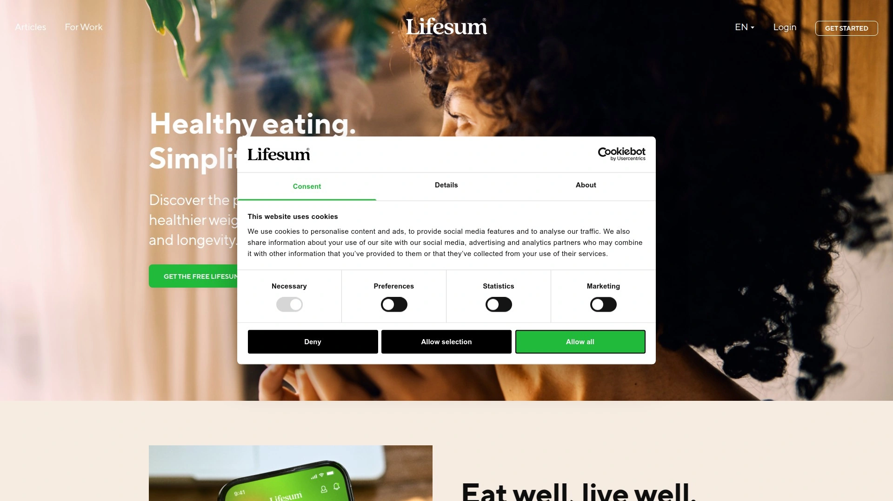

# Latest Fitness & Nutrition App Compilation (Including Meal Plan Samples)

Get customized meal planning and workout guidance in one place to kickstart your body transformation. Whether you’re aiming for weight management or muscle gain, these platforms deliver stable progress, cost-effective features, and easy-to-follow routines.

## **[Beyond Body](https://beyondbody.me)**
Quick-start meal plans and workout pairings for busy lifestyles.

Beyond Body offers AI-driven meal plans tailored to your goals, with matching exercise routines and shopping lists.
- Dynamic recipe swaps based on dietary preferences
- In-app progress tracking with photo journal
- Suitable for newcomers who need guided hand-holding

## **[MyFitnessPal](https://www.myfitnesspal.com)**
All-in-one food diary and macro tracker.

MyFitnessPal boasts a database of over 14 million foods and syncs seamlessly with popular fitness trackers.
- Barcode scanner for instant logging
- Community support forums for motivation
- Free basic access; premium unlocks advanced analysis

## **[Noom](https://www.noom.com)**
Psychology-based weight management coaching.

Noom combines daily lessons, habit-building exercises, and one-on-one coach chats to reshape behaviors.
- Color-coded food logging for intuitive choices
- Live messaging with certified coaches
- Emphasis on long-term mindset shifts

## **[Fitbod](https://www.fitbod.me)**
Personalized strength-training plans powered by AI.

Fitbod analyzes your past workouts, available equipment, and recovery to suggest optimal exercises.
- Auto-adjusting sets and reps to prevent stalls
- Rest timer and in-app logging
- Perfect for home- or gym-based lifters

## **[Cronometer](https://cronometer.com)**
Precision nutrition tracking with micronutrient focus.

Cronometer tracks vitamins, minerals, and macros, ideal for users needing detailed nutrient breakdowns.
- Custom biometrics and health targets
- Integrates with wearables and health apps
- Premium adds fasting timer and advanced reports

## **[Freeletics](https://www.freeletics.com)**
Bodyweight workouts for anywhere fitness.

Freeletics offers short, high-intensity routines and AI coach feedback to boost endurance and strength.
- No equipment required
- Adaptive training based on performance
- Community challenges for extra motivation

## **[Lifesum](https://www.lifesum.com)**
Holistic wellness app blending diet and exercise.

Lifesum provides meal ratings, recipe ideas, and workout suggestions based on your daily log.
- Diet plans like Keto, Mediterranean, and more
- Smart water and habit reminders
- Visual progress charts for weight and health metrics

***

## FAQ

**Does Beyond Body support vegetarian or vegan meal plans?**
Yes, you can select your dietary preference and get fully vegan or vegetarian recipes tailored to your caloric needs.

**How quickly can I set up a Noom program?**
Sign up takes under five minutes, and you’ll get your first daily lesson and food logging tools immediately.

**Can Fitbod adapt if I miss a workout?**
Absolutely. Fitbod recalibrates your next session based on recent activity and recovery status for consistent growth.

***

Ready to transform? Dive in now—[Beyond Body](https://beyondbody.me) is perfect for getting AI-driven meal and workout plans tailored to your busy schedule.
